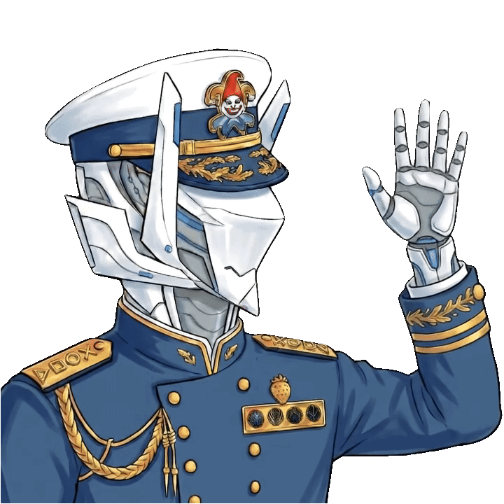

# Cephalon Slowbot

Cephalon Slowbot is a cross-server and platform Warframe LFG and alert bot for Steel Path Void Cascade Fissures. It monitors DE's API to detect active Steel Path Void Cascades and sends a notification when they pop up to every server it's invited to. The message will stay up for the duration of the cascade and give members of your server the option to "board". Once they select this, they'll be prompted to input their IGN and be assigned to a squad alongside everyone else who's done the same, regardless of which server they boarded from. All that's left is to send an in-game whisper, send out the invites, roll tile (if that's your thing) and get cascading!

## Features

* **Global LFG Pool:** Create a squad in one server, and it instantly updates the embed in every other server in the network.
* **Fissure Detection:** It checks and filters the DE API for Steel Path Zariman Fissures.
* **Intelligent Host Selection:** It uses a matrix to identify who the ideal host is for a cascade based on global network topology to minimise ping-related issues, since Warframe is P2P.
* **Automatic Pings for Full Squads:** It will notify squad members in *specifically* the server they boarded in about who their squad is and its suggested host the second the squad fills up. 
* **Automatic Message Deletion:** Once a cascade fissure expires, the bot will automatically delete its message to ensure the channel stays as clean as possible, preserving your guide's visibility at all times.

## Setup

Once you've invited Cephalon Slowbot (or any of its iterations) to your server, you'll need to get it set up. 

1. Decide which channel you'd like it to post cascade notifications in and type `/guide` if you'd like it to inform people how to use the bot, how to make sure they're ready for a cascade, and ensure that they know what to expect upon clicking board. 
   * *The guide is specifically tailored to my personal beliefs about the way the bot should function. If you'd like to preview what it will post, click on the `GUIDE.md` file in this repository. If you are unhappy with it in any way, feel free to write rules that better suit your community. If you've forked this repository to create your own instance of the bot, you can edit the guide output in the `commands.mjs` file to have your instance of the bot post it instead.*
2. Use the `/setup` command to ensure that the bot will post to the channel you've selected, and select which roles, if any, you'd like it to ping.
3. Wait for a fissure to pop, squad up, and get cascading!

## Creating your own version of this app

The Discord-specific instance of Cephalon Slowbot is hosted by me and is meant as a way for my alliance to cascade together. It isn't meant as a global LFG tool, but rather to team up with people I know and play with without having to worry about being in the same servers at the same time or pinging multiple channels.

However, I am firmly against elitism and have no intention of making this bot exclusive to servers within my alliance. Its purpose is to encourage cooperation across the entire Warframe community, and get people into my favourite game mode: Void Cascade.

To create your own version of this app, I've detailed the steps below:

### Create a Discord App

To start off with, you're going to need to create a Discord app through their [Developer Platform](https://discord.com/developers/applications/). Once you're in, name the bot what you'd like, give it a description, and get to work on the following: 

1. Ignore your public key (this won't be relevant for deploying the bot).
2. Note down your **Application ID**.
3. Navigate to the **Bot** panel, click on reset token, authenticate, and note down your token. **Do not share this token with anyone.**
   * *If this token appears in an unencrypted form anywhere online, the best-case scenario is Discord immediately killing your version of the bot. The worst case is someone hijacking it and, because of the permissions it requires, completely destroying your server.*
4. To set the bot to private, go to Installation, disable User Install (to make it Guild Install only), and set the install link to None (we'll be generating our own).
5. Skip OAuth2 for now (you don't actually need to do this, it's just more intuitive) and head over to the Bot tab. Disable the Public Bot setting and save your changes.
6. Navigate to OAuth2 and in the OAuth2 URL generator, grant it the following privileges: `applications.commands` (required for server-specific setup) and `bot` (required for functionality).
7. Grant the bot the following permissions: 
   * **View Channels & Read Message History:** This is how the bot is able to sync itself across servers.
   * **Send Messages & Embed Links:** This is how the bot posts and edits the Fissure LFG embed.
   * **Mention Everyone:** This is because the `/setup` command gives admins the option to select a role to ping when a cascade pops up. If you do not want your version of the bot to be able to ping people, this is optional. 
   * *I have tried to make sure it requires the fewest permissions possible to ensure security, though bear in mind that being able to embed links, send messages, and mention people still carries risk. I cannot emphasise enough how important it is to keep your token private.*
8. Note down your OAuth2 link; this is what you'll distribute to other servers to make them a part of your version of the bot's LFG network.

> **Note:** This bot has to log the server IDs, role IDs, member IDs, and channel IDs of the servers it is configured in. This prevents the bot from 'forgetting' its configuration every time an update is pushed to the code. These aren't secrets (they can be seen in Discord Developer mode), but I did want to provide this information up front for full transparency if you're using the bot. The host will have access to this information, although there's not a lot they can do with it and they don't pose any real security risk. 

### How to Host Your Own Instance

You will need to host this bot on a Virtual Private Server (VPS) so it runs 24/7. Below are the two best free/low-cost methods depending on your GitHub account age and activity.

#### Option A: Railway (For New GitHub Accounts)

Railway is the easiest platform to use and provides you with $5 of credit for the first 30 days of use. For every month after that, on its free plan, you get $1 of credit. So long as this is the only thing you're hosting on Railway, you shouldn't ever need to top up or provide any card details. Railway is the platform I use to host the bot since it's quick, reliable, and very easy to navigate.

To create your own version of this app on Railway:

1. Fork this repository.
2. Go to [Railway.app](https://railway.app/) and sign in with GitHub.
3. Click **New Project** -> **Deploy from GitHub repo** -> Select your fork.
4. Go to the **Variables** tab in your Railway project and add the following:
   * `TOKEN`: Your Discord Bot Token (the token you generated)
   * `CLIENT_ID`: Your Discord Bot Client ID (The Application ID)
5. Because cloud platforms use ephemeral storage, use `Ctrl/Cmd+K` in the bot's environment and search for "volume".
6. Create a volume, then attach it to your service and set the mount point as `/app/.data`.
7. Click on your bot iteration, press the settings tab, scroll down to Custom Start Command, and paste the text: `node register.mjs && node bot.mjs`
8. Click Deploy and you're good to go! 

#### Option B: Koyeb (For Established GitHub Accounts)

Koyeb's hobbyist tier is free, but strictly verifies GitHub accounts to ensure they have an established history. Although I host my iteration of the bot on Railway, I have already implemented code to ensure that it stays awake on Koyeb's hobbyist VPS plan.

1. Fork this repository.
2. Go to [Koyeb.com](https://www.koyeb.com/) and sign in with GitHub.
3. Click **Create Web Service** -> Select **GitHub** -> Choose your fork.
4. Under the **Environment Variables** section, add your `TOKEN` and `CLIENT_ID`.
5. Expand the **Builder** section, toggle the **Run command** override, and paste: `node register.mjs && node bot.mjs`
6. Expand the **Volumes** section, create a volume, and set the mount path to `/app/.data`.
7. Name your service and click **Deploy**. The built-in health-check server will ensure Koyeb keeps the bot awake.

### How to Install The Bot on your Server

Once the bot is deployed on the VPS of your choice, all that's left to do is use the `/guide` and `/setup` commands as an administrator of the server in a text/announcements channel. 

And that's it! Your iteration of Cephalon Slowbot is up and running! Go turn some thrax into prime parts and arcanes! 

This project is fully open source under the MIT license, so as long as you have the license file in your fork, you're free to do with it what you will. While I would really appreciate being credited in your app description, you're under no compulsion to do so.

---

## Support/Receive Updates on the Project

If you'd like to track, test, provide feedback, or contribute to the bot's functionality, you can find out more about it in my discord:
  

If Cephalon Slowbot helped you make good use of your mod drop chance booster, any donation towards my caffeine addiction, further project development, streams/YouTube, and/or getting me to TennoCon would be much appreciated! 

  
 

May your RNG be better than mine! See you around, Tenno!
